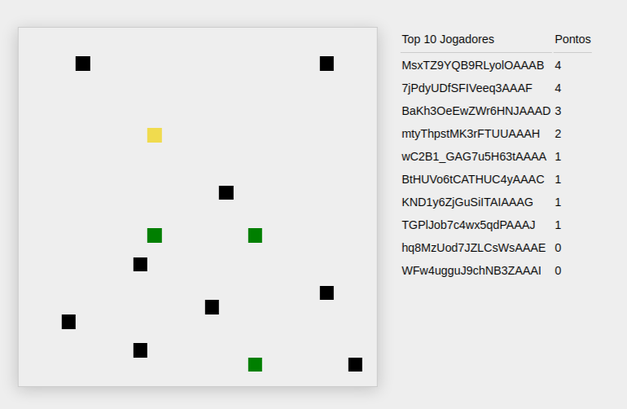

# Take The Fruits

Jogo multiplayer para testar o Socket.io



## Tecnologias utilizadas
* javascript
* node
* express
* socket.io

## Pré-requisitos

Node.js 13 - https://nodejs.org/

## Instação

```bash
$ npm install
```

## Rodando a aplicação

```bash
$ npm run start
```
